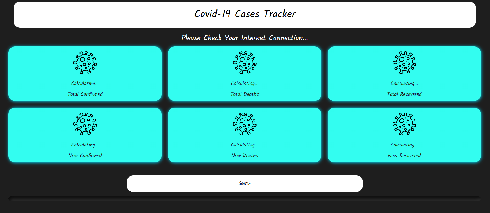

# Realtime Worldwide COVID-19 Stats Webpage

## Description

This webpage provides real-time COVID-19 statistics for any country worldwide. The data is sourced from an API and is updated regularly to ensure accurate and up-to-date information. Users can easily access the latest COVID-19 cases, deaths, recoveries, and other relevant data for their selected country through an intuitive and user-friendly interface. The project aims to keep users informed about the current pandemic situation and promote awareness of the ongoing global health crisis.

Click this link to visit our Webpage: https://mukeshsundar23.github.io/Worldwide-covid19-stats/

## Features and Functionality

- **Realtime Data:** Access the latest COVID-19 statistics in real-time for any country.
- **Global Coverage:** The webpage covers data for all countries worldwide.
- **Country Selection:** Users can choose a specific country to view its detailed COVID-19 stats.
- **Key Metrics:** Display of key metrics, including confirmed cases, deaths, recoveries, and active cases.
- **Data Source:** The data is sourced from a reliable and up-to-date COVID-19 API.

## Data Source and API Information

- Data Source: The COVID-19 statistics displayed on this webpage are sourced from an API that provides reliable and real-time data on the pandemic.
- API Endpoint: The API endpoint used to fetch COVID-19 data is [insert API endpoint URL].
- Data Attribution: The COVID-19 data displayed on this webpage is provided by [insert data source name], and proper attribution is given to the data source.

## Installation and Setup

As this project is a webpage, there is no installation required. Users can directly access the webpage using the provided URL.

1. Open your web browser and go to https://mukeshsundar23.github.io/Worldwide-covid19-stats/.
2. Once the webpage loads, you will see the global COVID-19 statistics overview.
3. To view data for a specific country, use the country selection dropdown or interactive map.
4. The data will be automatically updated as new information becomes available from the API.

## Screenshots

## Contact

If you have any questions, feedback, or need support, you can contact us at [mukeshsundar2362004@gmail.comm](mailto:mukeshsundar2362004@gmail.com).

